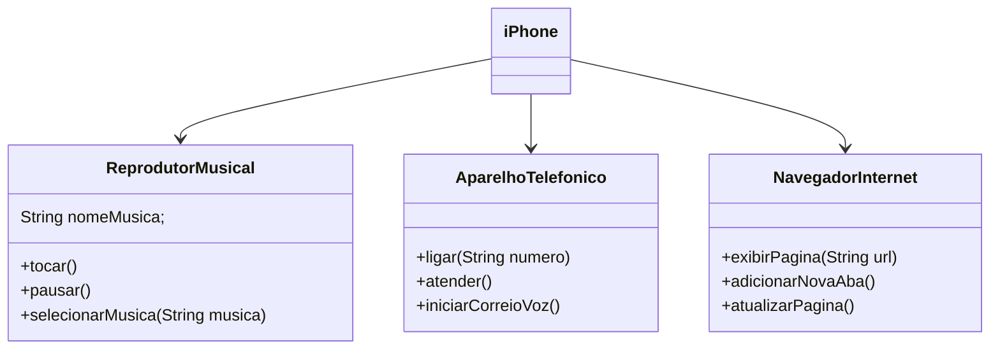

###POO - Abstraindo um Bootcamp Usando Orientação a Objetos em Java

#### Classes(Atributos + Métodos)
1. **Reprodutor Musical**
   - Atributos: `nomeMusica`
   - Métodos: `tocar()`, `pausar()`, `selecionarMusica(String musica)`
3. **Aparelho Telefônico**
   - Métodos: `ligar(String numero)`, `atender()`, `iniciarCorreioVoz()`
4. **Navegador na Internet**
   - Métodos: `exibirPagina(String url)`, `adicionarNovaAba()`, `atualizarPagina()`

### Diagrama UML (Mermaid)

